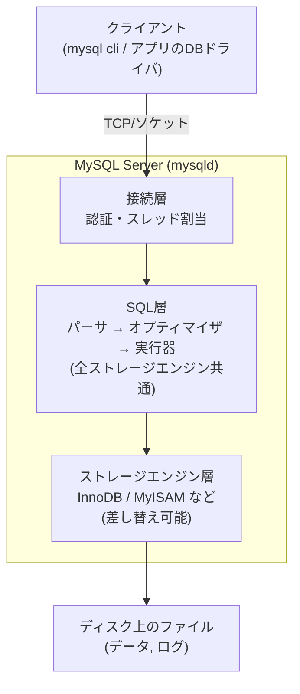

# 第01章 環境構築と RDBMS の全体像

- 実施日: 2026-09-05
- 所要: 1セッション

## 学んだこと
- MySQL はクライアント層 → SQL層(パース/オプティマイザ/実行器) → ストレージエンジン層 の3層構造で、
  SQL層は全エンジン共通、ストレージエンジン層だけが差し替え可能(PostgreSQL/Oracle との大きな違い)。
- `SHOW ENGINES;` で確認できる通り、InnoDB だけが `Support: DEFAULT` かつ `Transactions: YES`。
- トランザクションのロールバックは MyISAM では効かない(非トランザクションエンジンのため)。
  一方 UNIQUE 制約自体はトランザクションの有無と無関係に機能する(誤解しやすい点)。
- 本編でほぼ常に InnoDB を前提にするのは、ロールバックによる整合性保証と外部キー制約が
  実務上ほぼ必須だから。

## 手を動かしたこと
```sql
SELECT VERSION();
SHOW ENGINES;

CREATE TABLE t_innodb (id INT PRIMARY KEY) ENGINE=InnoDB;
CREATE TABLE t_myisam (id INT PRIMARY KEY) ENGINE=MyISAM;

START TRANSACTION;
INSERT INTO t_innodb VALUES (1);
ROLLBACK;
SELECT * FROM t_innodb;   -- 空 (ロールバックされた)

START TRANSACTION;
INSERT INTO t_myisam VALUES (1);
ROLLBACK;
SELECT * FROM t_myisam;   -- 1件残る (ロールバックされない)
SHOW WARNINGS;            -- Some non-transactional changed tables couldn't be rolled back

DROP TABLE t_innodb, t_myisam;
```

## 図



## つまずき / 誤解した点
- 「トランザクションがないと UNIQUE 制約(一意性)が保証できない」と誤解した。
  実際は UNIQUE/PRIMARY KEY はトランザクションと無関係に機能する。
  MyISAM が実務で困る本当の理由は「ロールバック不可」と「外部キー制約が使えない」の2点。

## 覚えておくコマンド・構文
- `SHOW ENGINES;` — 利用可能なストレージエンジンと特性(Transactions/XA/Savepoints)を確認
- `SHOW WARNINGS;` — 直前の1文の警告を確認(直後に打たないと消える)
- `CREATE TABLE ... ENGINE=xxx;` — テーブル単位でストレージエンジンを指定

## 次への宿題
- InnoDB の内部構造(ページ/バッファプール/REDO・UNDO)は第10章で深掘り。
