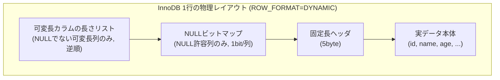
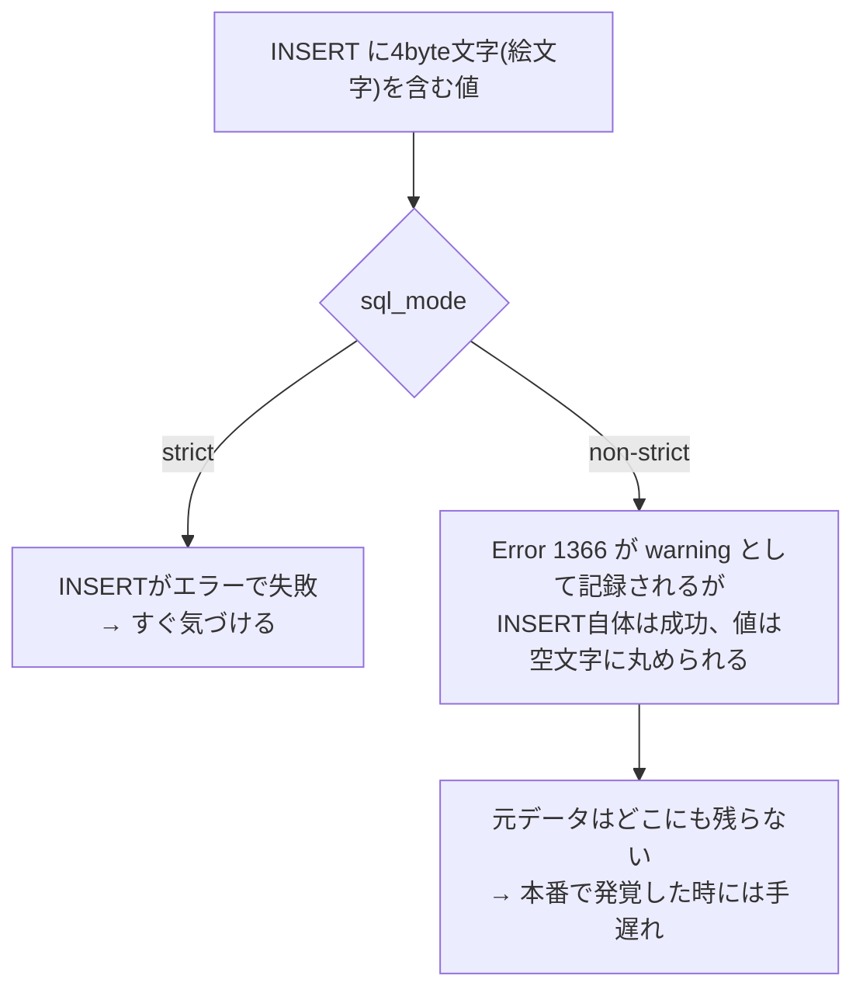

# 第02章 データ型とテーブル定義

- 実施日: 2026-09-05
- 所要: 1セッション

## 学んだこと
- 型には固定長(INT/BIGINT/DATETIME等)と可変長(VARCHAR/TEXT等)があり、
  固定長は「オフセット計算だけ」で行内の目的カラムに到達できるが、
  可変長カラムを挟むと「手前の長さを読んでから次の位置を確定する」手間が増える。
- InnoDB(ROW_FORMAT=DYNAMIC/COMPACT)の1行の物理レイアウトは、
  実データより前に「可変長カラムの長さリスト(NULLでない列だけ、逆順)」→
  「NULLビットマップ(NULL許容列だけ、1bit/列)」→「固定長ヘッダ(5byte)」の順で並ぶ。
  NULLの列は長さリスト自体に載らない(そもそも記録する意味がないため)。
- NOT NULL にすると NULLビットマップの1bit分の余地が不要になる。値の実体サイズは変わらないので
  効果は微々たるものだが、列数×行数が大きいテーブルでは無視できない差になり得る。
- VARCHAR(255) のように宣言サイズを大きく取っても、ディスク上の実データサイズは
  実際に入っている文字列の長さで決まる(255は容量を圧迫しない)。
  一方で GROUP BY/ORDER BY で index が使えず一時テーブルが作られる場面では、
  宣言サイズがそのまま一時テーブルの見積り・確保サイズに影響しうる
  (内部エンジンやバージョンに依存するため、断定はせず今後の章で実測して確認する)。
- MySQLの `utf8` は歴史的事情で1文字最大3byteまでの制限版で、絵文字などの4byte文字が入らない。
  本物のUTF-8を使うには `utf8mb4` を明示的に指定する必要がある。
- `sql_mode` が非strictだと、4byte文字を `utf8` カラムに INSERT した際
  `Error 1366 Incorrect string value` が`SHOW WARNINGS`に出るにも関わらず
  **INSERT自体は成功し、値は静かに空文字へ丸められる**。strictモードならINSERT自体が失敗する。
  → 本番でこの設定ミスがあると、気づいた時には元データが既に失われており復旧不能。
- 文字コード(charset)と照合順序(collation)は別レイヤーの話。
  MySQL 8.0 のデフォルト `utf8mb4_0900_ai_ci` は大文字小文字・アクセント記号を区別しない。
  `email` のような列では区別しないのが自然なことが多いが、`username`等で区別したい場合は
  `_as_cs` や `_bin` を明示的に指定する必要がある(既定のままだと UNIQUE制約が
  意図せず「大文字小文字違いを同一」として弾く事故につながる)。

## 手を動かしたこと
```sql
CREATE TABLE emoji_test (
  id INT PRIMARY KEY AUTO_INCREMENT,
  name VARCHAR(50) CHARACTER SET utf8
);

-- 端末から絵文字を直接ペーストできなかったため、UTF-8バイト列を直接指定して検証
INSERT INTO emoji_test (name) VALUES (CONVERT(UNHEX('F09F9880') USING utf8mb4));
SHOW WARNINGS;
-- Error 1366 Incorrect string value: '\xF0\x9F\x98\x80' for column 'name' at row 1
-- (non-strictモードのため INSERT 自体は成功し、値は空文字になる)

SELECT id, HEX(name), LENGTH(name), CHAR_LENGTH(name) FROM emoji_test;

-- 照合順序(collation)の確認
SHOW TABLE STATUS FROM studydb;   -- Collation: utf8mb4_0900_ai_ci

INSERT INTO emoji_test (name) VALUES ('ABC'), ('abc');
SELECT * FROM emoji_test WHERE name = 'abc';
-- 'ABC' と 'abc' の両方がヒット (ai_ci = 大文字小文字を区別しない)
```

## 図





## つまずき / 誤解した点
- VARCHARが可変長な理由を最初「全角文字でバイト数が変わるから」と答えたが、
  それは文字コードの話。本質は文字コードに関係なく「文字数(長さ)自体が可変」であること。
- 固定長カラムのオフセット計算の話を「ロッカーの番号を数える」例えで理解しようとしたが、
  ロッカーには物理的なラベル(番号)が見えるため例えとして不適切だった。
  実際のディスク/メモリ上のデータには区切りやラベルが無く、バイト列の連続でしかない、
  という前提を踏まえる必要があった。
- 「WHERE name = 'x' の検索が可変長カラムだと大変」という話を、
  「1行内のオフセット計算」と「行と行の間の検索(index)」で混同した。
  前者は本章の話、後者は index/B+木(第09章)の話で、レイヤーが異なる。
- 一時テーブル肥大化の話を「OOMになる」と早合点した。正確には
  `tmp_table_size` 上限を超えるとディスク上の一時テーブルに切り替わり、
  ディスクI/O悪化としてクエリが遅くなるのが主な症状(内部エンジンやバージョン依存の
  ため断定はせず、後の章で実測確認する)。
- 「VARCHAR(255)の255という宣言サイズがディスク容量を圧迫する」と誤解した。
  ディスク上の実データサイズは実際の文字列長で決まり、255自体は容量を消費しない。
  255が効いてくるのは一時テーブルの見積りの場面。

## 覚えておくコマンド・構文
- `SHOW WARNINGS;` — 直前の1文の警告を確認(複数文を跨ぐと消えるので、確認したい文の直後に打つ)
- `HEX(col)` / `LENGTH(col)` / `CHAR_LENGTH(col)` — 実際に格納されているバイト列・byte数・文字数を確認
- `CONVERT(UNHEX('...') USING utf8mb4)` — 端末から直接ペーストできない文字(絵文字等)を
  UTF-8バイト列から組み立てて検証する
- `SHOW TABLE STATUS FROM <db>;` — テーブルごとの Collation 等を確認

## 次への宿題
- なし(次章: 03 SELECTの論理的処理順序)
