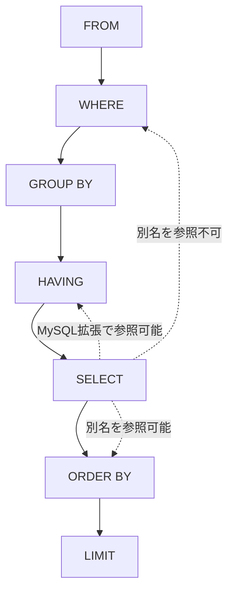

# 第03章 SELECT の論理的処理順序

- 実施日: 2026-09-17（途中）
- 所要: -

## 学んだこと
- SELECT の論理的処理順序: `FROM → WHERE → GROUP BY → HAVING → SELECT → ORDER BY → LIMIT`
- `WHERE` は `GROUP BY` より前に評価されるため、`SELECT` 句で定義した別名は `WHERE` からは参照できない
- `ORDER BY` は `SELECT` より後に評価されるため、`SELECT` 句の別名を参照できる
- MySQL は標準 SQL の評価順に反して `HAVING`（および `GROUP BY`）でも `SELECT` 句の別名を参照できる独自拡張を持つ

## 手を動かしたこと
```sql
CREATE TABLE employees (
    id INT PRIMARY KEY AUTO_INCREMENT,
    name VARCHAR(50),
    dept_id INT,
    salary INT,
    status VARCHAR(20)
);

INSERT INTO employees (name, dept_id, salary, status) VALUES
('Alice', 1, 500000, 'active'),
('Bob',   1, 420000, 'active'),
('Carol', 1, 600000, 'retired'),
('Dave',  2, 380000, 'active'),
('Eve',   2, 410000, 'active'),
('Frank', 2, 390000, 'active'),
('Grace', 3, 700000, 'active'),
('Heidi', 3, 650000, 'active');

-- WHERE で SELECT 句の別名 cnt は参照できずエラー
SELECT dept_id, COUNT(*) AS cnt
FROM employees
WHERE cnt > 5
GROUP BY dept_id;
-- ERROR 1054: Unknown column 'cnt' in 'where clause'

-- ORDER BY では別名を参照できる
SELECT dept_id, COUNT(*) AS cnt
FROM employees
GROUP BY dept_id
ORDER BY cnt DESC;

-- HAVING でも別名を参照できる（MySQL の拡張）
SELECT dept_id, COUNT(*) AS cnt
FROM employees
GROUP BY dept_id
HAVING cnt > 2;
```

## 図



## つまずき / 誤解した点
-

## 覚えておくコマンド・構文
-

## 次への宿題
- 集約と NULL の三値論理（本編の続き）
